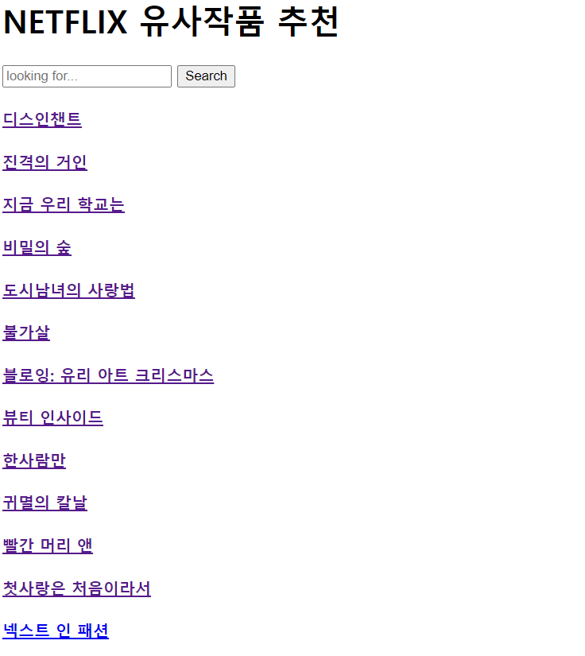
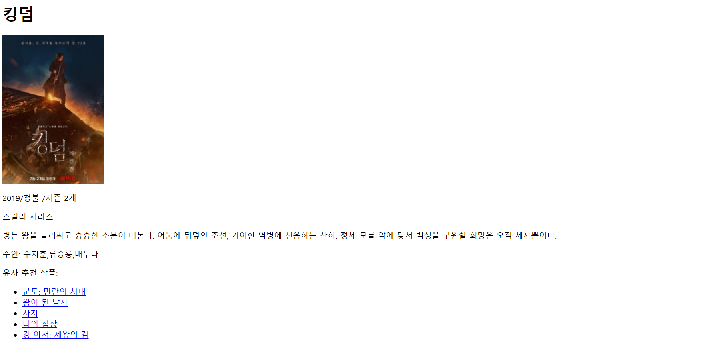
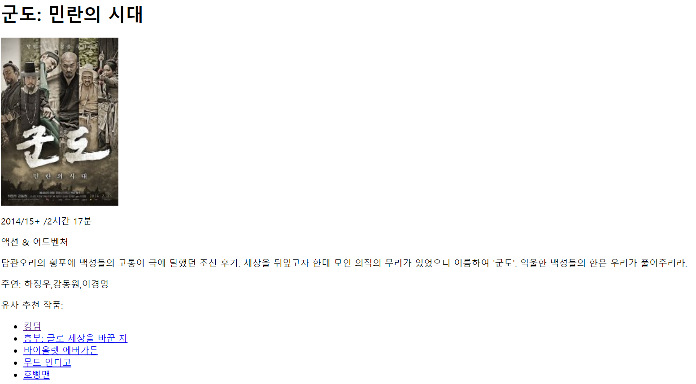
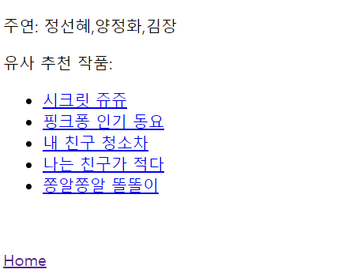
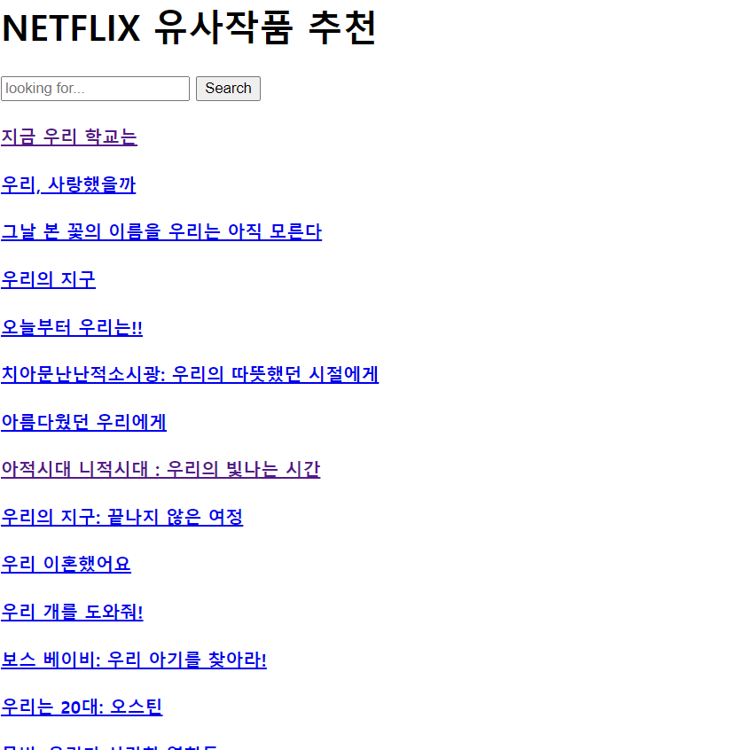
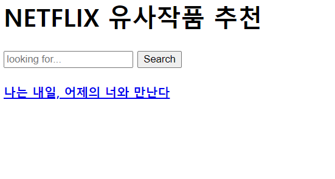

# 작품 줄거리를 활용한 넷플릭스 추천 시스템

넷플릭스 작품들의 줄거리를 활용하여 유사도를 검증하고, 줄거리 유사도가 가장 높은 5 개 작품을 추천해주는 웹 사이트

(2022년 02월 12일까지의 데이터만을 기반으로 개발됨)

#### - 홈 화면 : 작품을 검색하거나 작품을 눌러 해당 작품의 소개 및 추천 작품을 본다. 

#### - '킹덤' 화면 : '킹덤'이라는 작품을 클릭한 화면이다. 제목과 더불어 작품의 정보가 뜨고, 해당 작품과 유사한 작품 5 개의 리스트를 볼 수 있다. 

#### - '군도: 민란의 시대' 화면 : '킹덤' 화면에서 '군도: 민란의 시대'를 클릭하여 들어온 화면이다.

#### - 'Home' 버튼: 유사 추천 작품 아래에는 'Home' 버튼이 있다. 이를 누르면 홈 화면으로 이동한다.

#### - '우리' 검색: 홈 화면에서 검색창에 '우리'를 검색하면 '우리'가 제목에 포함된 작품들이 검색된다. 

#### - '내일어제' 검색 : 검색창에 띄어쓰기나 각종 특수문자를 제외하고 입력하더라도 검색이 된다.

